```md
<div align="center">


[github.com/MiteshGorad](https://github.com/MiteshGorad)

</div>


> M.Sc. Computer Science student from Pune, India.<br>
> Passionate about Embedded Systems, Robotics, Linux, and Open Source.

I enjoy designing hardware and software that work together—from embedded
firmware and IoT devices to robotic systems and Linux-based projects.
Currently exploring ESP32, Raspberry Pi, STM32, PCB design, and automation.


<samp>C &nbsp; Python &nbsp; Java &nbsp; Embedded C &nbsp; Arduino &nbsp; ESP32 &nbsp; STM32 &nbsp; Raspberry Pi &nbsp; Linux &nbsp; KiCad &nbsp; Git</samp>


**🤖 4-DOF Robotic Arm** &nbsp;·&nbsp; <samp>ESP32, Servo Motors</samp><br>
A robotic arm controlled using potentiometers with a responsive web interface
for future wireless control.

**📡 Offline Voice Assistant** &nbsp;·&nbsp; <samp>Python, Vosk, Piper TTS</samp><br>
A privacy-focused offline voice assistant running on Linux using local speech
recognition and text-to-speech.

**🌱 Smart IoT Projects** &nbsp;·&nbsp; <samp>ESP32, Sensors</samp><br>
Embedded automation projects including smart irrigation, monitoring systems,
and IoT experiments.

**🔧 Electronics & Robotics** &nbsp;·&nbsp; <samp>Embedded Systems</samp><br>
Learning PCB design, embedded firmware, Linux development, and building
custom robotics hardware.


<div align="center">




</div>


Every graphic on this profile is generated automatically using GitHub Actions.
The statistics are fetched from the GitHub GraphQL API and updated daily,
committing changes only when needed.

The SVG graphics are self-hosted inside this repository, so nothing depends on
external services while viewing this profile.

Built with ❤️ using GitHub Actions, Python, SVG, and Git.
```
